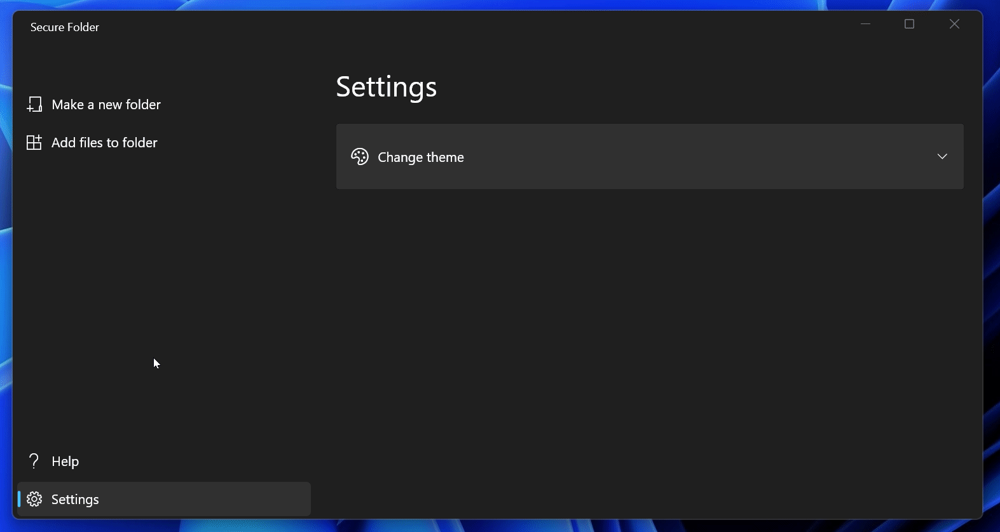

# SecureFolder

## About

SecureFolder is a Windows OS only app that makes password protected folders which you can access easily.
It uses the latest Windows 11 fluent design to give the best user experience.

## Platform support

Supports only Windows 11 for now. Planned support for Windows 10 will arrive soon.

## Known bugs

Preview release, no functionality yet

## Preview





## Installation
Download the required files from the **Releases** tab, install it in your device and run it.

## Dev Installation

1) Install [Flutter](https://flutter.dev/docs/get-started/install) and necessary plugins for your editor.

2) Open your terminal and run the following:

```shell
$ git clone https://github.com/dhzdhd/SecureFolder.git
$ cd SecureFolder
$ flutter pub get
```

3) Run the app on Windows -

```shell
$ flutter run --release
```

## Contributing

Any sort of contributions are welcome to make this app better.

1) Make an issue.
2) Create a new branch related to the issue.
3) Create a PR and request a review.


## Getting Started With Flutter

A few resources to get you started if this is your first Flutter project:

- [Lab: Write your first Flutter app](https://flutter.dev/docs/get-started/codelab)
- [Cookbook: Useful Flutter samples](https://flutter.dev/docs/cookbook)

For help getting started with Flutter, view the
[online documentation](https://flutter.dev/docs), which offers tutorials,
samples, guidance on mobile development, and a full API reference.